# Belajar Menggunakan Markdown

## Pengenalan
---

Assalamualaikum dan hai semua, disini saya akan mengajar anda bagaimana cara untuk menggunakan Markdown secara mudah dan apa yang perlu kita tahu jika ingin menggunakan Markdown.

## Apakah Markdown?
---

Markdown adalah *markup language* yang mudah dan ringan.

## Apakah kegunaan Markdown?
---

Digunakan:

1. Dalam fail README di Github dan lain-lain.
1. Dalam artikel blog seperti laman web SIG ini.
1. Lain-lain lagi.

## Sintaksis(_Syntax_) Markdown
---

1. [Heading](#Heading)
1. [Emphasis](#Emphasis)
1. [Strikethrough](#Strikethrough)
1. [Blockqoute](#Blockqoute)
1. [Comment](#Comment)
1. [List](#List)
1. [Link](#Link)
1. [Table](#Table)
1. [Horizontal Rule](#Horizontal_Rule)
1. [Inline HTML](#Inline_HTML)
1. [Code dan Syntax Highlighting](#Code_and_Syntax_Highlighting)
1. [Line Break](#Line_Break)

<h3 id="Heading">Heading</h3>

_Heading_ Markdown dan HTML adalah sama iaitu mempunyai 6 jenis _Heading_.Dalam Markdown heading dimulakan dengan simbol _hash_ (#) dan seterusnya nama heading seperti gambar dibawah:

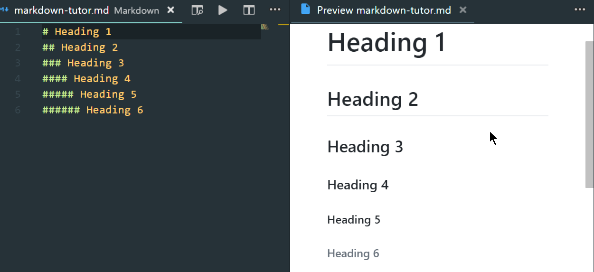

<h3 id="Emphasis">Emphasis</h3>

_Emphasis_ adalah seperti _italic_ dan __bold__.

Dalam Markdown, _italic_ menggunakan simbol _asterisks_ (*) atau _underscore_ (_) seperti gambar dibawah:

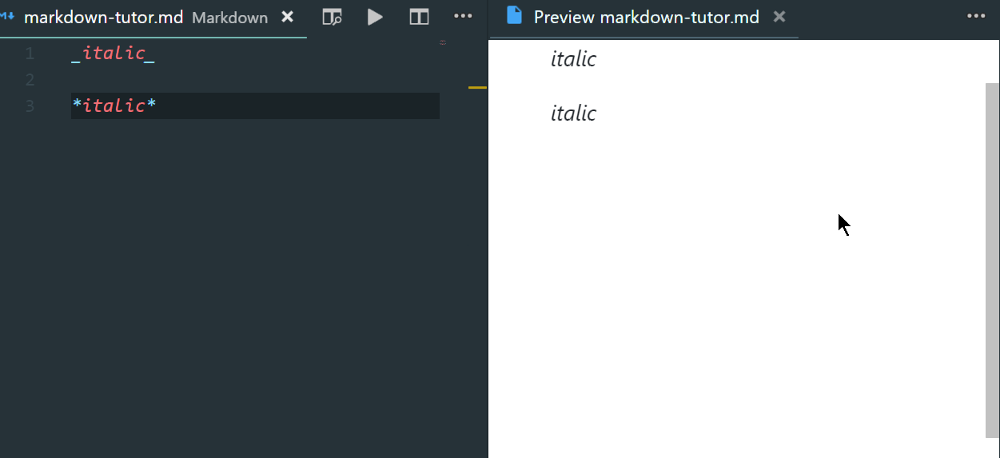

Selain itu, __bold__ menggunakan 2x simbol _asterisks_  (**) atau 2x _underscore_ (__) seperti gambar dibawah:

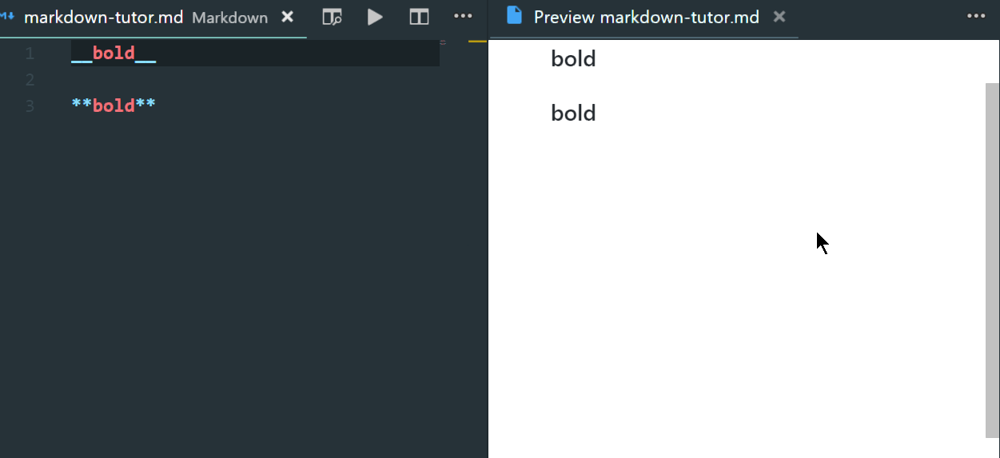

dan jika anda mahu menggunakan simbol * dan _ tanpa membuat teks anda menjadi _italic_ atau __bold__, anda boleh menambah simbol backslash \ sebelum simbol * atau _ seperti gambar dibawah:

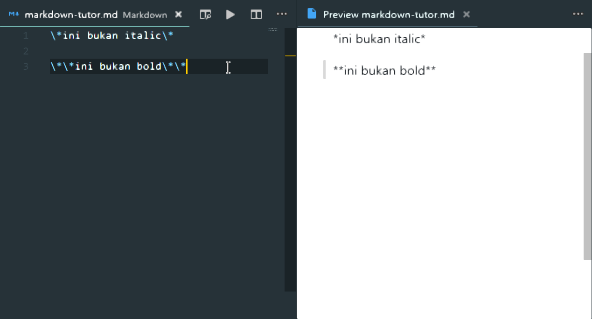

<h3 id="Strikethrough">Strikethrough</h3>

Strikethrough adalah teks yang mempunyai garis di tengah seperti perkataan ~~ini~~.

Kita boleh membuat teks strikethrough dengan menggunakan 2x simbol _tilde_ (~~) seperti gambar dibawah:

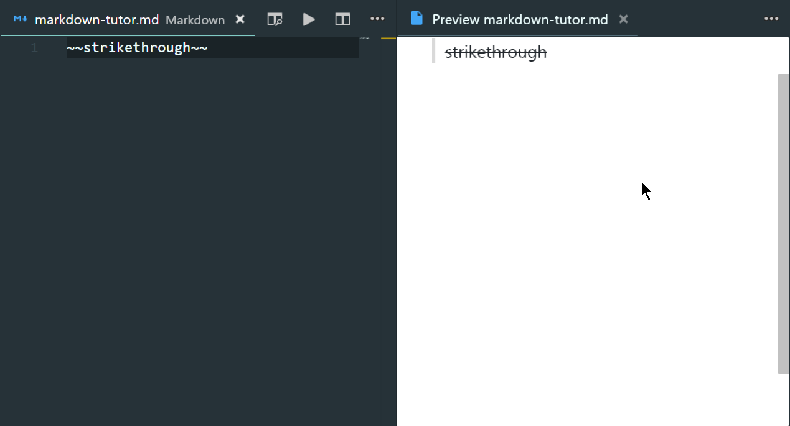

<h3 id="Blockqoute">Blockqoute</h3>

_Blockqoute_ digunakan untuk memberi penekanan kepada sesuatu ayat yang penting.

Kita boleh membuat _blockqoute_ dengan mengunakan simbol angel bracket (>) seperti gambar dibawah:

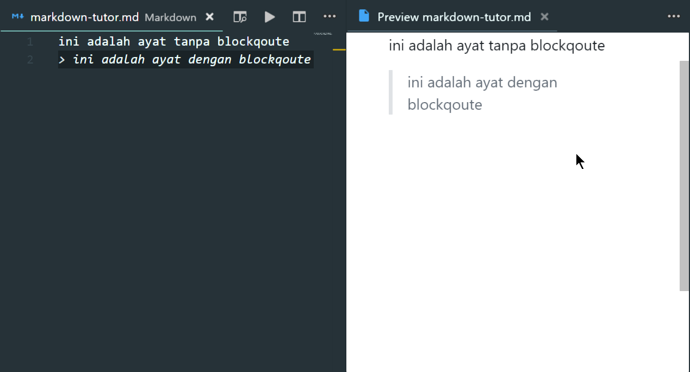

<h3 id="Comment">Comment</h3>

_Comment_ adalah ayat atau teks yang tidak akan dipaparkan dalam fail yang sudah diproses (_execute_).

Ada pelbagai cara untuk menulis _comment_, tetapi saya menggunakan _comment_ gaya HTML kerana ianya mudah untuk ditulis berbanding dengan gaya yang lain. 

Sebagai contoh, seperti gambar dibawah:

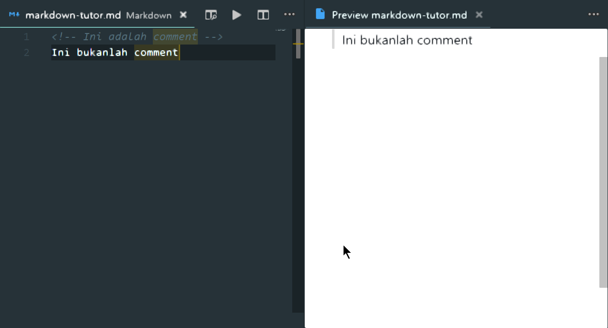

<h3 id="List">List</h3>

List boleh dibahagikan kepada dua iaitu _unordered list_ dan _ordered list_.

Unordered list adalah list yang tidak mempunyai urutan huruf atau nombor iaitu seperti dibawah:

* list
* list
* list

Orderded list pula adalah list yang mengikut urutan huruf atau nombor iaitu seperti dibawah:

1. list
1. list
1. list

Anda boleh membuat unordered list dengan menggunakan simbol asterisks (*) dan manakala untuk ordered list anda perlu menggunakan huruf 1 dan titik@noktah seperti gambar dibawah:

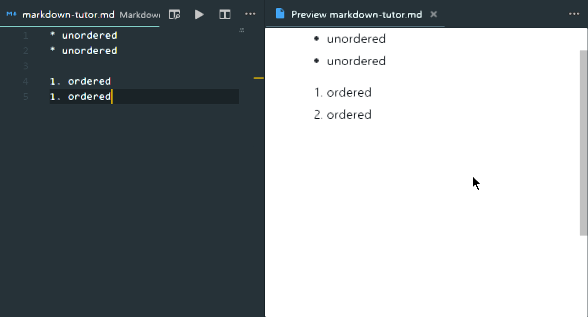

<h3 id="Link">Link</h3>

Link digunakan untuk memaut sesuatu URL atau fail kedalam fail [Markdown](./markdown.md).

Kita boleh memautkan URL atau fail kedalam fail Markdown dengan menggunakan sintaksis ini:

```Markdown
[nama output](URL @ fail)
```

atau seperti gambar dibawah:

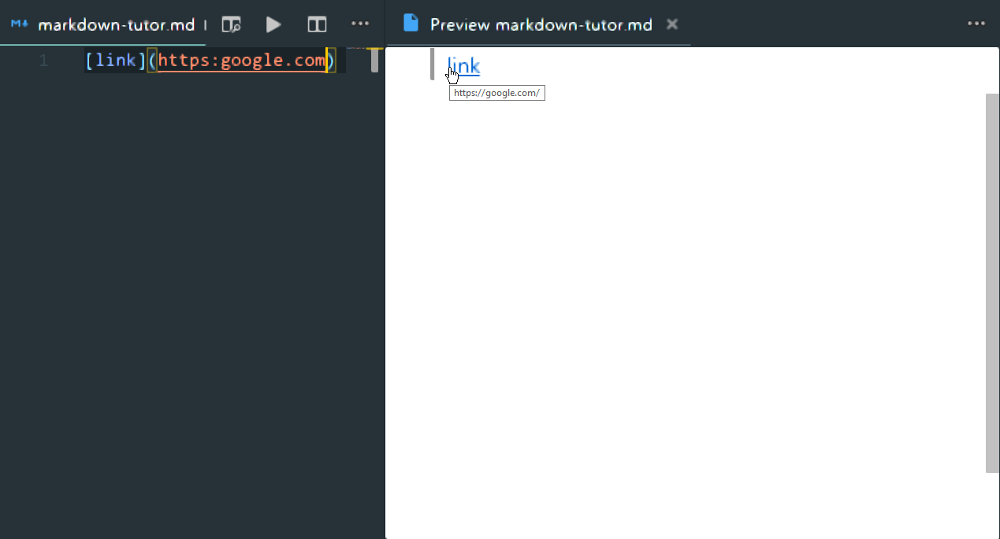

Jika anda ingin menambah gambar anda boleh menggunakan sintaksis ini:

```Markdown

```

atau seperti gambar dibawah:


<h3 id="Table">Table</h3>

Table atau jadual selalunya digunakan untuk mengisi atau pengurusan data-data yang penting.

Kita boleh membuat _table_ dengan gabungan simbol pipe (|) dan hyphens (-) seperti gambar dibawah:

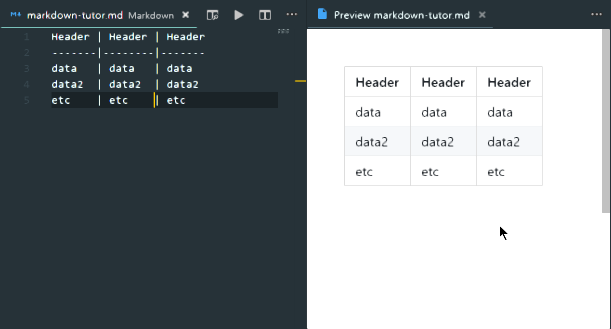


<h3 id="Horizontal_Rule">Horizontal Rule</h3>

_Horizontal Rule_ adalah garis seperti dibahagian bawah ini:

---

_Horizontal Rule_ menggunakan 3x atau lebih simbol hyphens (-), asterisks(*) seperti gambar dibawah: 


<h3 id="Inline_HTML">Inline HTML</h3>

Anda juga boleh menggunakan sintaksis HTML di dalam Markdown tanpa sebarang masalah seperti dibawah:

```html
<table>
    <tr>
        <th>Header 1</th>
        <th>Header 2</th>
        <th>Header 3</th>
    </tr>
    <tr>
        <td>Data 1</td>
        <td>Data 2</td>
        <td>Data 3</td>
    </tr>
</table>
```
Output:
<table>
    <tr>
        <th>Header 1</th>
        <th>Header 2</th>
        <th>Header 3</th>
    </tr>
    <tr>
        <td>Data 1</td>
        <td>Data 2</td>
        <td>Data 3</td>
    </tr>
</table>

<h3 id="Code_and_Syntax_Highlighting">Code dan Syntax Highlighting</h3>

Kita boleh membuat _code block_ di Markdown tanpa _Syntax Highlighting_ tetapi kebanyakkan _renderer_ seperti __Github__ dan lain-lain menyokong _code block_ dengan _Syntax Highlighting_.Terdapat berdozen bahasa pengaturcaraan(_Programming_) yang disokong oleh _renderer_ yang menggunakan [highlight.js](https://highlightjs.org/static/demo/ "highlight.js").

Anda menulis _code block_ dengan menggunakan 3x back-tick (`) seperti dibawah:

<pre>
```javascript

code disini

```
</pre>

atau seperti gambar dibawah:

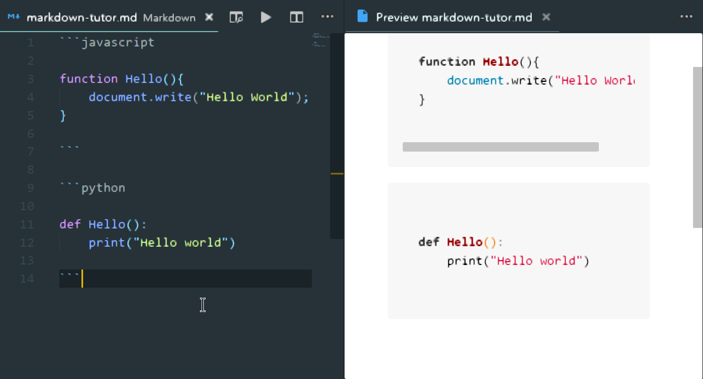

<h3 id="Line_Break">Line Breaks</h3>

Line Breaks atau dalam HTML \<br> adalah berfungsi untuk membawa teks atau ayat ke baris yang baharu.

Anda hanya perlu meninggal satu ruang kosong seperti membuat perenggan dalam Bahasa Melayu untuk membuat Line Breaks seperti gambar dibawah:

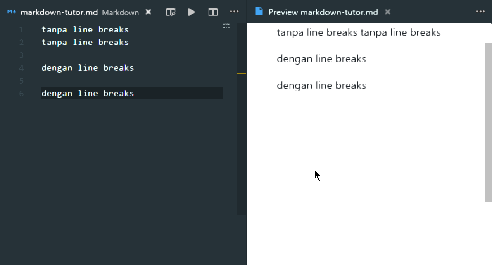

## Kesimpulan
---

Kesimpulannya, Markdown adalah senang untuk dipelajari oleh semua orang walaupun tidak mempunyai latar belakang IT.Anda boleh mendapatkan maklumat lanjut mengenai Markdown di sini [Markdown Cheatsheet](https://github.com/adam-p/markdown-here/wiki/Markdown-Cheatsheet#alt-h2 "by Adam Pritchard").


